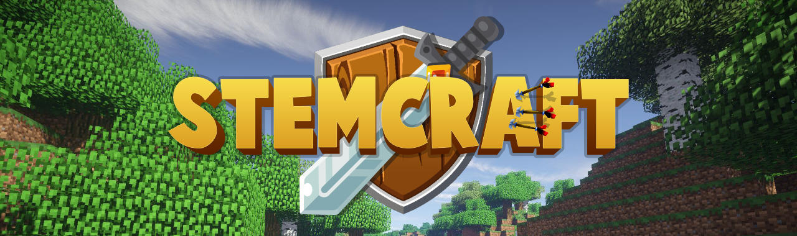

<!--suppress HtmlDeprecatedAttribute -->
<p align="center"></p>

# STEMCraft

This is the core STEMCraft plugin that provides the core functionality and helper methods for the STEMCraft server and other STEMCraft Plugins.

## Requirements

- Java 25
- Paper 26.2 or higher


## Usage

- Players: read the [STEMCraft Player Handbook](docs/pub/README.md).
- Developers and administrators: read the [STEMCraft Wiki](https://github.com/STEMMechanics/stemcraft/wiki).

## Builds & API

Releases for the current default branch are published through GitHub Actions and GitHub Releases.

To include the API in your project, add the repository to your project:

```
repositories {
    maven {
        url = uri("https://maven.stemmechanics.com.au/")
    }
} 
```

Add STEMCraft API codebase as a dependency:

```
dependencies {
    compileOnly("dev.stemcraft:stemcraft-api:1.0.0-SNAPSHOT")
}
```

To access the API in your code:

```
STEMCraftAPI.api(); 
```

`STEMCraftAPI.api();` may be null until after the STEMCraft plugin enables.

## Pl3xMap theme

An optional STEMCraft-branded theme for Pl3xMap is available in
[`tools/pl3xmap-theme`](tools/pl3xmap-theme). It adds the STEMCraft logo and colour palette to the
map controls, sidebar, popups, and mobile layout without changing map tiles or marker data.

Stop the server and install it over Pl3xMap's generated web directory:

```sh
tools/pl3xmap-theme/install.sh /path/to/plugins/Pl3xMap/web
```

Then set `settings.web-directory.read-only: true` in Pl3xMap's configuration before restarting.
See the [theme README](tools/pl3xmap-theme/README.md) for testing, rollback, and Pl3xMap upgrade
instructions.

## Get in touch!

Learn more about what we're doing at [stemmechanics.com.au](https://stemmechanics.com.au).

👋 [@STEMMechanics](https://twitter.com/STEMMechanics)
