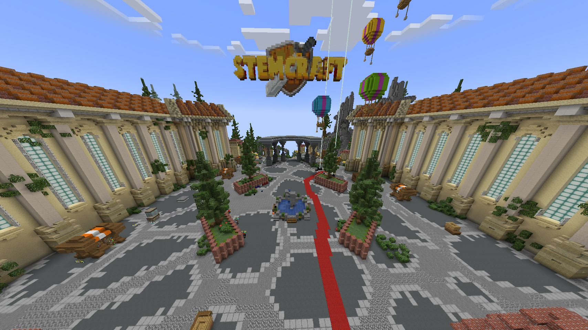

# STEMCraft Player Handbook

<figure><figcaption></figcaption></figure>

STEMCraft is a community-driven Minecraft server created and managed by [STEMMechanics](https://www.stemmechanics.com.au/). This handbook is for players: how to join, play Survival and minigames, use player commands, and get help.

Start with [Getting Started](getting-started/README.md), or jump to [Survival](survival/README.md), [Minigames](minigames/README.md), or [Safety & Community](safety-and-community/README.md).


Developer, API, configuration, and administrator documentation lives in the repository's `docs/dev` directory and GitHub Wiki, not in this handbook.


News, galleries, events, and staff information are published by STEMMechanics and through the community's social channels and Discord.
