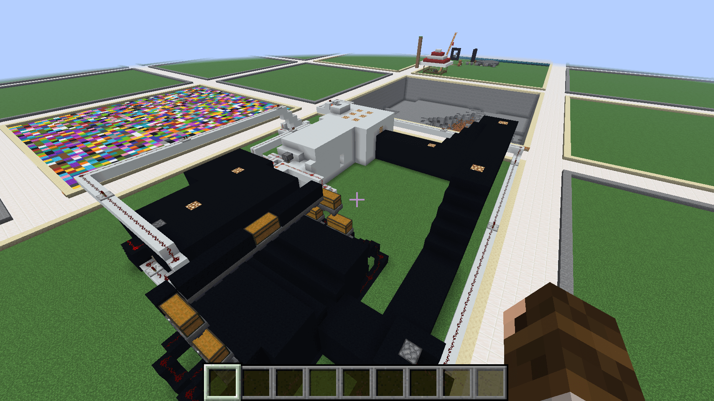
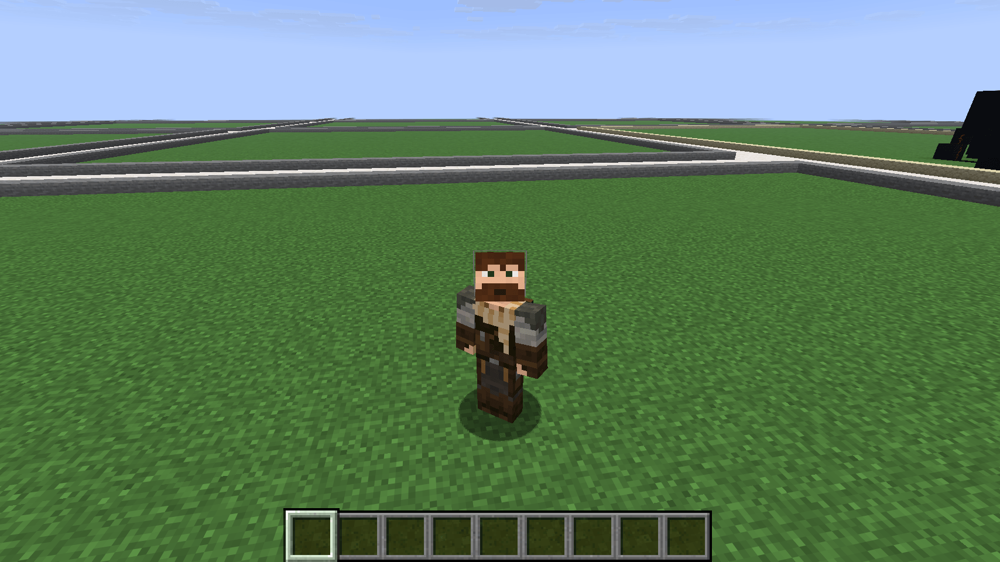

# Creative

Want to build without worrying about gathering resources? The **Creative world** gives you your own plot where you can build, experiment and create using Creative mode.

<figure><figcaption></figcaption></figure>


The Creative world is separate from Survival. Builds and items cannot be transferred between the two worlds.


### Getting to Creative

There are two ways to enter the Creative world:

* Type `/creative` in chat.
* Enter the **Creative portal** from the Hub.

<figure><figcaption></figcaption></figure>

You'll arrive in the Creative world surrounded by player plots.

### Claiming a Plot

Before you can start building, you'll need a plot of your own.

1. Find an available, unclaimed plot.
2. Stand inside the plot you want.
3. Type `/plot claim`.
4. That's it! The plot is now yours and you can start building.

<figure><figcaption></figcaption></figure>


**Want us to find a plot for you?**

Type `/plot auto` to automatically find and claim an available plot.


### Your Plot

Once you've claimed a plot, you're free to build!

Use the blocks and items available in Creative mode to experiment, practise building or create something huge.

Remember that the [Community Expectations](safety-and-community/README.md) still apply in the Creative world.

### Useful Plot Commands

| Command       | What it does                      |
| ------------- | --------------------------------- |
| `/plot auto`  | Find and claim an available plot  |
| `/plot claim` | Claim the plot you're standing in |
| `/plot home`  | Return to your plot               |

More commands can be found in the [Commands guide](commands/README.md).

### Selection Particles

If the server's WorldEdit selection particles get in your way, use `/selpreview off` to hide them. Use `/selpreview on` to show them again, or `/selpreview` to toggle. Your preference is saved across reconnects. Use `/selpreview grid on` or `/selpreview grid off` to control the additional grid independently, or `/selpreview grid` to toggle it. The grid defaults off and automatically hides when any selection side exceeds 64 blocks (configurable by the server). It returns when the selection is small enough again. These controls do not hide minigame or other feature highlights.

This hides STEMCraft's WorldEdit outline and corner particles while keeping your selected region and WorldEdit commands available. Other feature highlights and client-side selection displays have their own controls.

## Build together

Use `/plot info` while standing in a plot to check its owner and membership. `/plot add <player>` allows a helper to build while you are online; `/plot trust <player>` also permits building while you are offline. Only add people you trust. `/plot remove <player>` removes that access. Plot limits and available commands depend on your rank.

## Merge neighbouring plots

Claim the neighbouring plots you want to join, stand in one and face the neighbour, then use `/plot merge`. Read any confirmation prompt before accepting. The plots must meet the server's ownership, adjacency and size rules; it is not a way to take someone else's land.

## Clear or delete a plot

`/plot clear` removes the build but keeps your claim. `/plot delete` removes the build and releases the claim. Both are destructive. Check `/plot info`, save anything you need, and read the prompt before using `/plot confirm` if asked. Do not confirm an old request you no longer want.

Keep redstone and entities reasonable, respect neighbouring builds, and do not use WorldEdit to bypass plot protection. [Formatted signs](signs.md) can label your builds where your rank permits them.

> **Image placeholder — plot management:** Show two owned neighbouring plots before/after merging. Below them, show the clear/delete confirmation prompt with the ownership and destruction warnings highlighted.

Plot command behaviour follows [PlotSquared’s command guide](https://intellectualsites.gitbook.io/plotsquared/features/commands); the server controls which commands your rank can use.
