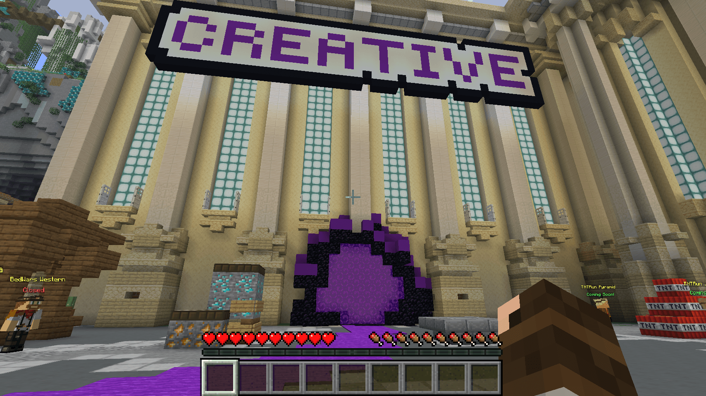

# Creative

Want to build without worrying about gathering resources? The **Creative world** gives you your own plot where you can build, experiment and create using Creative mode.

> 📷 **IMAGE: Creative world overview**\
> A wide screenshot looking across the Creative plots, ideally showing several interesting player builds.


The Creative world is separate from Survival. Builds and items cannot be transferred between the two worlds.


### Getting to Creative

There are two ways to enter the Creative world:

* Type `/creative` in chat.
* Enter the **Creative portal** from the Hub.

<figure><figcaption></figcaption></figure>

You'll arrive in the Creative world surrounded by player plots.

### Claiming a Plot

Before you can start building, you'll need a plot of your own.

1. Find an available, unclaimed plot.
2. Stand inside the plot you want.
3. Type `/plot claim`.
4. That's it! The plot is now yours and you can start building.

> 📷 **IMAGE: Empty Creative plot**\
> Screenshot from inside an unclaimed plot. Include the surrounding road or plot boundary so it's obvious what area the player will be claiming.


**Want us to find a plot for you?**

Type `/plot auto` to automatically find and claim an available plot.


### Your Plot

Once you've claimed a plot, you're free to build!

Use the blocks and items available in Creative mode to experiment, practise building or create something huge.

Remember that the [Community Expectations](app://-/safety-and-community/README.md) still apply in the Creative world.

### Useful Plot Commands

| Command       | What it does                      |
| ------------- | --------------------------------- |
| `/plot auto`  | Find and claim an available plot  |
| `/plot claim` | Claim the plot you're standing in |
| `/plot home`  | Return to your plot               |

More plot commands can be found on the [Commands](app://-/commands.md) page.
