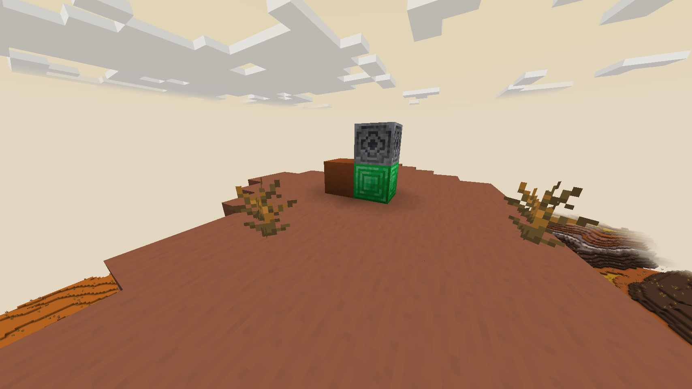

---
layout:
  width: default
  title:
    visible: true
  description:
    visible: false
  tableOfContents:
    visible: true
  outline:
    visible: true
  pagination:
    visible: true
  metadata:
    visible: true
  tags:
    visible: true
  actions:
    visible: true
---

# Waystones

Waystones allow players to setup teleport points around the world in an adhoc fashion. A waystone is made up of a lodestone on top of a emerald, diamond or gold block.

When right clicking on the lodestone with an empty hand, a player will teleport around the nearest waystone that is sitting on top of the same block, up to 4000 blocks away.


You are not guaranteed to be teleported to a safe location so be wary of others creating waystone traps.


<figure><figcaption></figcaption></figure>
