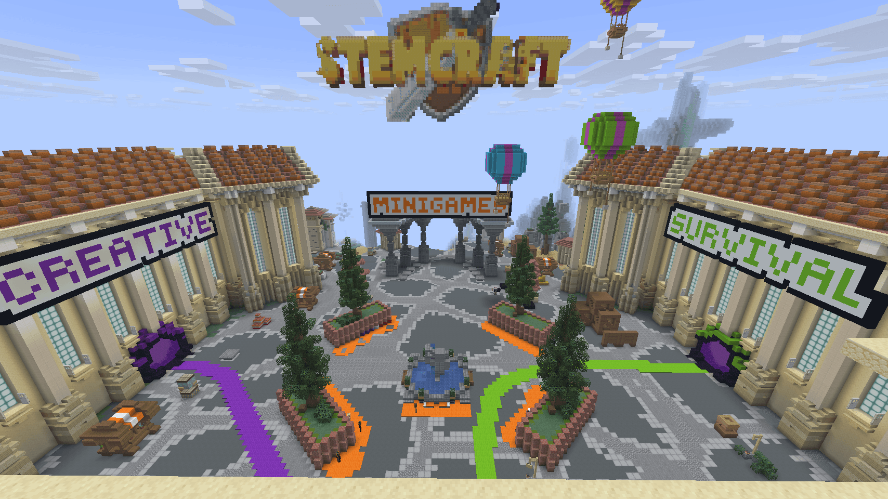
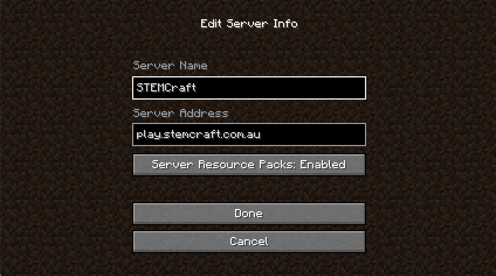
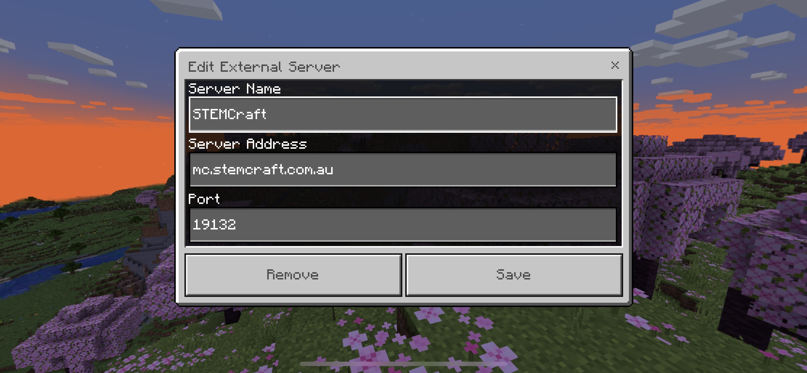

# Getting Started

Ready to join STEMCraft? You can play using **Minecraft Java Edition** or **Minecraft Bedrock Edition**.

<figure><figcaption></figcaption></figure>

### Before You Join

You'll need Minecraft and a Microsoft account to play.

STEMCraft supports both **Java and Bedrock players**, so everyone plays together on the same server.


**Which Minecraft version do I need?**

Visit the [STEMCraft website](https://www.stemmechanics.com.au/stemcraft) to see the current server status and supported Minecraft version.


## Java Edition

Add a multiplayer server with the address **play.stemcraft.com.au**.

<figure><figcaption>
Java Edition connection settings
</figcaption></figure>

## Bedrock Edition

Add a server with the address **play.stemcraft.com.au** and port **19132**.

<figure><figcaption>
Bedrock Edition connection settings
</figcaption></figure>

## Consoles


Some consoles don't include an **Add Server** option, so joining custom Minecraft servers like STEMCraft may require additional setup.

Unfortunately, we're unable to provide support for console connection methods, as the steps vary between consoles and can involve changing your device or network settings.


## Accept the Resource Pack

When you connect, Minecraft will ask you to accept the **STEMCraft resource pack**.

**Make sure you accept it.**

The resource pack adds STEMCraft's custom items, textures, icons and other special features. Without it, some things may look like ordinary Minecraft items or may not display correctly.


**Something doesn't look right?**

Reconnect and make sure you've accepted the resource pack. Java players can also type `/resourcepack` to have the pack sent again.


## Your First Join

The first time you connect to STEMCraft, you may be asked a **simple maths question**.

Type your answer into Minecraft chat and send it. This quick check helps us keep bots out of the server.

Once you've completed the check, you're ready to explore STEMCraft!

## Where Next?

When you arrive, you'll start in the **STEMCraft Hub**.

From there you can use the portals to visit different worlds and games, or use commands to get around.

Not sure where to begin? Head into **Survival** to start your adventure, visit **Creative** to claim a plot and build, or check out the available **Minigames**.


**You're ready to play!**

Have fun, be kind to other players and remember to check out the [Safety & Community](safety-and-community/) section.

