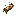

# Useful Rotten Flesh

Zombie drops are not rubbish anymore! You can turn Rotten Flesh into farming supplies, leather, wolf treats, bait, or a strange stew.

| Dog Treat | Zombie Bait |
| :---: | :---: |
|  |  |
| Heals tamed wolves | Attracts zombies |


If these items look like an ordinary Bone or Rotten Flesh, accept the [STEMCraft resource pack](../getting-started/resource-pack.md).


## Compost Rotten Flesh into Bone Meal

This does **not** use a crafting table. Start with an empty Composter and use one Rotten Flesh on it at a time.

1. Place a Composter.
2. Hold Rotten Flesh.
3. Use the Rotten Flesh on the Composter eight times.
4. When the Composter is full, collect 1 Bone Meal normally.

Every Rotten Flesh reliably fills one level, so an empty Composter takes exactly **8 Rotten Flesh**.

> **Image placeholder — Rotten Flesh composter:** Add three side-by-side in-game screenshots: an empty Composter, a player adding Rotten Flesh, and the full Composter producing Bone Meal. Put a large “8× Rotten Flesh” label over the middle image and a “1× Bone Meal” label over the final image. Keep the held Rotten Flesh and hotbar visible for young readers.

## Leather

Fill all nine crafting squares with **Rotten Flesh**.

| Rotten Flesh | Rotten Flesh | Rotten Flesh |
| :---: | :---: | :---: |
| Rotten Flesh | Rotten Flesh | Rotten Flesh |
| Rotten Flesh | Rotten Flesh | Rotten Flesh |

**You receive:** 1 Leather.

## Dog Treat

Use four **Rotten Flesh** and one **Bone**. This recipe is shapeless, so the ingredients may go in any squares.

| Empty | Rotten Flesh | Empty |
| :---: | :---: | :---: |
| Rotten Flesh | **Bone** | Rotten Flesh |
| Empty | Rotten Flesh | Empty |

**You receive:** 2 Dog Treats.

Right-click a **tamed wolf** with a Dog Treat to:

- Heal it by more than ordinary Rotten Flesh.
- Put it into normal breeding mode if it is an adult, healthy, and ready to breed.
- Keep it safe from the Hunger effect.

Players cannot eat Dog Treats.

> **Image placeholder — feeding a wolf:** Add a bright in-game screenshot of a young player holding the Dog Treat beside a tamed wolf. Show hearts above a full-health adult wolf, and include a small inset showing an injured wolf before and after healing. Capture with the STEMCraft pack active and keep the hotbar visible so the treat icon is recognisable.

## Zombie Bait

Combine four **Rotten Flesh**, one **Spider Eye**, and one **String**. The recipe is shapeless.

| Rotten Flesh | String | Rotten Flesh |
| :---: | :---: | :---: |
| Empty | **Spider Eye** | Empty |
| Rotten Flesh | Empty | Rotten Flesh |

**You receive:** 1 Zombie Bait.

Zombies smell bait from farther away:

- Keeping it anywhere in your inventory increases their detection range to about **1.5× normal**.
- Holding it in either hand increases their detection range to about **2× normal**.
- Dropping it attracts zombies within about **20 blocks**.

Throw bait away from yourself, into a reachable pit, or along a path into a trap. Zombies walk to it using normal paths. The first zombie that reaches the dropped stack eats one piece. Zombie Bait cannot be eaten by players.


Walls still matter. Zombies only follow dropped bait when they can find a valid path, and carrying bait can bring zombies toward you from much farther away.


> **Image placeholder — zombie trap:** Add a wide night-time screenshot showing a player throwing Zombie Bait into a fenced pit while several zombies follow a visible walking route toward it. Add simple arrows labelled “Throw bait” and “Zombies follow”. Do not use a DisplayEntity or floating model; the bait should visibly be the normal dropped custom item.

## Rotten Flesh Stew

Combine one **Bowl**, one **Rotten Flesh**, one **Brown Mushroom**, and one **Red Mushroom**. The recipe is shapeless and does not replace any vanilla Suspicious Stew recipes.

| Brown Mushroom | Bowl | Red Mushroom |
| :---: | :---: | :---: |
| Empty | **Rotten Flesh** | Empty |
| Empty | Empty | Empty |

**You receive:** 1 Rotten Flesh Stew.

Eating it gives approximately:

- **20 seconds of Night Vision**
- **10 seconds of Hunger**

It is useful in the dark, but zombie cooking has consequences!
