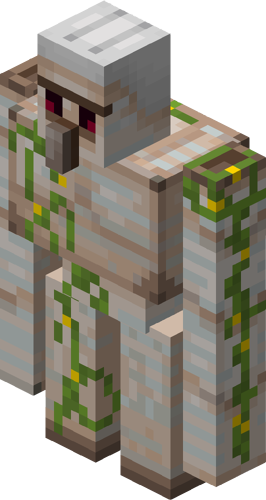

# Rebalances

STEMCraft has various changes and tweaks to rebalance the Vanilla Minecraft gameplay to be a smoother experiance.

Rebalances are typically voted on in the [Discord](https://discord.gg/yNzk4x7mpD) by the whole community.

## Entities and Mobs

### Iron Golems

<figure><figcaption></figcaption></figure>

Iron Golems drop iron nuggets instead of iron ingots. This still allows players to obtain iron easily, however prevents iron from being devalued.

### Phantoms

Phantoms no longer spawn in the Overworld and instead spawn in the End. This makes the End dimension much more challenging.

### Villagers

1. All enchanted books obtained through villagers are bought with Lapis Lazuli instead of Emeralds.
2. Villagers only accepted emerald blocks as payment. They will pay players with regular emeralds. Obtaining items from villagers was typically easier than getting them manually. This change in trades makes players still able to get any item they want from villagers, but encourages them to get the items manually if they need them in bulk.

## Items

### Anvils 

Modifying or repairing an item multiple times in an anvil does not increase its experience cost. In Vanilla Minecraft, even after repairing an item a few times in an anvil, the cost quickly becomes too high. On STEMCraft, you can keep repairing and enchanting items through anvils forever

### Stonecutters

The stonecutter now has the following recipes:

* 2 x Gravel can be obtained from a Cobblestone block
* 2 x Sand can be obtained from a Gravel block
