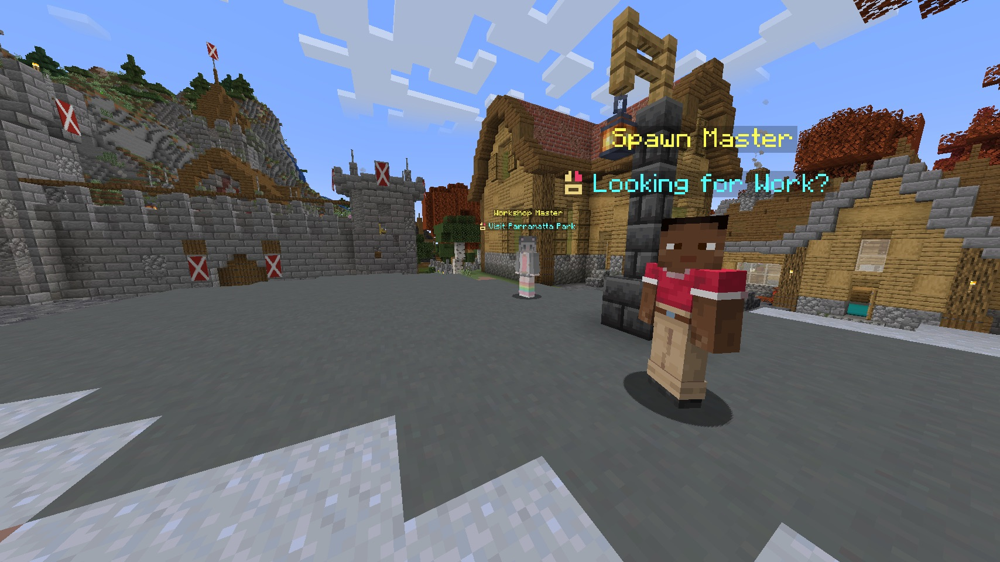

# Survival

STEMCraft Survival keeps the familiar Minecraft progression while adding practical community features, custom items, and selected [Changes from Vanilla](changes-from-vanilla.md).

## Start here

- Learn about [sleep voting, coordinates, and friendly world names](sleeping-and-navigation.md).
- See the server's [quality-of-life improvements](quality-of-life.md) and [changes from vanilla](changes-from-vanilla.md).
- Turn zombie drops into useful items with [Rotten Flesh recipes](../items-and-crafting/rotten-flesh-uses.md).
- Find slime chunks with a [Slime in a Bucket](../items-and-crafting/slime-and-magma-buckets.md).

Current plugin-backed features also include [mailboxes](mailboxes.md), [notice boards](notice-boards.md), [graves](graves.md), [animal barrels](animal-barrels.md), automatic End Dragon respawning, and destructive [Comet](comets.md) events.


[Waystones](waystones.md), [traders](traders.md), and [survival cities](survival-cities.md) are ideas for the future. They are not normal live Survival features yet.

