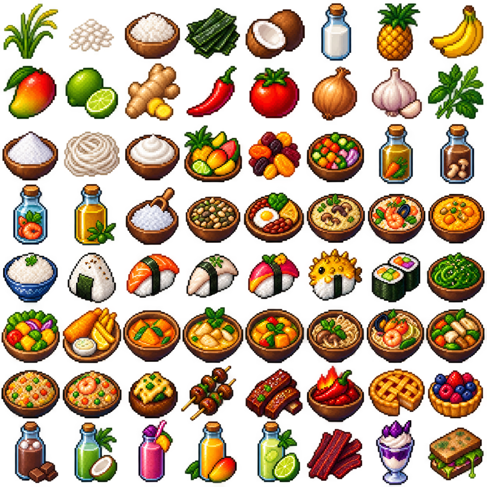

# Farming, Foraging & Cooking

The Cooking collection adds 64 ingredients, prepared components, meals and drinks. Explore different biomes, establish a flooded rice field, gather coastal ingredients and turn ordinary catches into sushi, noodles, curries and risotto.

## Growing rice

Use shears on seagrass in swamps, mangrove swamps and warm coastal waters for a chance to find **Rice Shoots**. Place a shoot on a **Mud** block with a source block of water directly above it. Rice needs light and grows while its chunk is loaded.

Mature rice drops Rice and replacement Rice Shoots. Fortune increases a mature harvest. Cook Rice in a furnace or smoker, then use it in rice bowls, rice balls, sushi, fried rice or risotto.

## Tropical foraging

Natural blocks can provide ingredients when broken:

* Jungle leaves may drop coconuts, bananas, mangoes or limes. Fruit chances vary by biome.
* Grass and ferns may reveal ginger, chilli peppers, tomatoes, onions, garlic, herbs or pineapples.
* Shearing kelp or seagrass in ocean biomes may produce Edible Seaweed.
* Player-placed leaves and ground cover do not generate forage drops.

Once harvested, these ingredients can be combined into stocks, coconut milk, rice flour, noodles, chopped vegetables, oil, salt and other cooking components.

## Meals and effects

Meals range from ordinary filling food to short situational buffs. **Miner's Breakfast** provides Haste I for 75 seconds. Sushi can provide Water Breathing, Dolphin's Grace or Luck. Curries, tropical drinks and special meals may provide Resistance, Speed, Regeneration or Absorption.

Food buffs are deliberately shorter than potions. Read the item's lore before eating unusual dishes: Pufferfish Sushi, Nether Chilli, Phantom Jerky and Rotten Sandwich have drawbacks.

## Potion of Haste

Add an **Amethyst Shard** to Awkward Potions to brew Potions of Haste. Redstone extends Haste I; Glowstone makes a shorter Haste II potion. Miner's Breakfast is the convenient food version, while potions are intended for longer mining trips.

Recipes are available through Minecraft's recipe book after they are discovered. The live server may adjust drop chances, growing times, recipes and effect durations.
